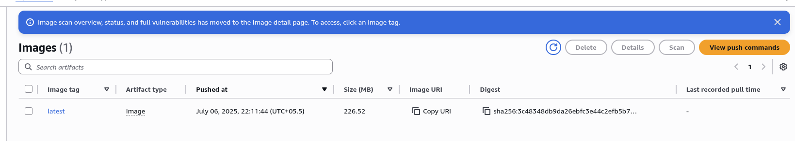

# Course-End Project: Deploying a Web Application to AWS

## Project Goals

This project will guide you through the end-to-end process of deploying a containerized web application using modern cloud infrastructure. You will:
*   Containerize a web application using Docker.
*   Store the container image in Amazon Elastic Container Registry (ECR).
*   Deploy the container on a serverless platform using AWS Fargate.
*   Expose the application to the internet securely using an Application Load Balancer.

## Prerequisites

*   **AWS Account**: An active AWS account with administrative privileges.
*   **AWS CLI**: The AWS Command Line Interface, configured with your credentials.
*   **Git**: For cloning the application repository.
*   **Docker**: Docker Desktop (or Docker Engine on Linux) running on your local machine.

## Step 1: Prepare the Environment

1.  **Configure AWS CLI**:
    ```bash
    $ aws configure
    ```
    

2.  **Clone the Application Repository**:
    ```bash
    $ git clone https://github.com/ramkrishnatest/ECS-Fargate.git
    $ cd ECS-Fargate/
    $ ls
    ```
    

3.  **Test the Application Locally**:
    ```bash
    $ docker build -t my-web-app .
    $ docker run -p 8081:8080 my-web-app
    ```
    *Note: The application is accessible at the path `/LoginWebApp-1`. Access it in your browser at `http://localhost:8081/LoginWebApp-1`.*
    
    
    

## Step 2: Build and Push the Docker Image to ECR

1.  **Create an ECR Repository**:
    ```bash
    $ aws ecr create-repository --repository-name my-web-app --region us-east-1
    ```
    *Copy the `repositoryUri` from the output. You will need it in the next steps.*

2.  **Authenticate Docker to ECR**:
    ```bash
    $ aws ecr get-login-password --region us-east-1 | docker login --username AWS --password-stdin 389736397675.dkr.ecr.us-east-1.amazonaws.com
    ```
    
    

3.  **Tag and Push the Image**:
    ```bash
    $ docker tag my-web-app:latest 389736397675.dkr.ecr.us-east-1.amazonaws.com/my-web-app:latest
    $ docker push 389736397675.dkr.ecr.us-east-1.amazonaws.com/my-web-app:latest
    ```
    
    

---

## Step 3: Create Core ECS Infrastructure

1.  **Create an ECS Cluster**:
    ```bash
    $ aws ecs create-cluster --cluster-name my-dev-cluster --region us-east-1
    ```
    
    

2.  **Create a Task Definition**:
    
    *   **Name and Launch Type**: Provide a task definition name and select **AWS Fargate**.
        

    *   **Container Details**: In the `Container` section, enter a container name and paste the **Image URI** you copied from ECR.
        

    *   **Port Mappings**: Set the `Container port` to `8080` with the `TCP` protocol.
        

    *   **Resource Allocation**: Define the task size
        

    *   **Log Collection**: Confirm the default log collection settings are enabled
        

    *   **Create**: Review the details and create the task definition.
        

---

## Step 4: Test the Task Definition by Running a Single Task

1.  **Run Task**: From the task definition screen, click **Actions > Run Task**.
    
    

2.  **Configure and Launch**:
    *   Select your existing cluster (`my-dev-cluster`) and ensure **Fargate** is chosen.
        
    *   Under **Networking**, select a VPC and subnet(s). **Crucially, enable "Public IP"** so you can access the task directly from the internet for this test.
        
    *   Click **Create**.
        

3.  **Verify the Running Task**:
    *   Wait for the task status to change from `PROVISIONING` to `RUNNING`.
        
    *   Click the **Task ID** to view its details.
        
    *   In the **Network** section, find and copy the **Public IP** address.
        
    *   Open your browser and navigate to `http://3.89.243.226:8080/LoginWebApp-1/`. You should see your application. This confirms the task definition works!
        


## Step 5: Create a Service with a Load Balancer

1.  **Navigate to Create Service**: In your cluster, go to the **Services** tab and click **Create**.
    

2.  **Configure Compute Options**:
    *   Select your cluster (`my-dev-cluster`) and choose **Fargate**.
        
        

3.  **Configure Deployment**:
    *   **Service Type**: Choose `Replica`.
    *   **Desired tasks**: Set to `2` to ensure high availability.
        
    *   **Deployment type**: Choose `Rolling update`. This ensures zero-downtime deployments.
        

4.  **Configure Networking**: Select your VPC and subnets.
    

5.  **Configure Load Balancing**:
    *   Select **Application Load Balancer** and provide a name (e.g., `dev-loadbalancer`).
    *   For the listener, choose **Create a new listener** on port `8080` for `HTTP` traffic.
    *   For the target group, choose **Create a new target group**.
        
    *   **Target Group Details**:
        *   **Name**: `dev-target`
        *   **Health check path**: Set this to your application's root path, `/LoginWebApp-1/`. This is crucial for the load balancer to know if your tasks are healthy.
        
        

6.  **Create the Service**: Review all settings and click **Create**.
    

7.  **Verify Deployment**:
    *   Wait for the service to become stable and the tasks to be in the `RUNNING` state.
    *   Navigate to **EC2 > Load Balancers**. Select your `dev-loadbalancer` and check that the associated targets in the target group are **healthy**.
        
    *   Copy the **DNS name** of the load balancer.
        
    *   Navigate to the URL in your browser: `http://dev-loadbalancer-1304550596.us-east-1.elb.amazonaws.com:8080/LoginWebApp-1/`. Your application should be live!
        

## Conclusion

This end-to-end process involved building a Docker image, pushing it to Amazon ECR, and deploying it with Amazon ECS and AWS Fargate. The Application Load Balancer provides a stable endpoint and distributes traffic across your tasks for high availability.