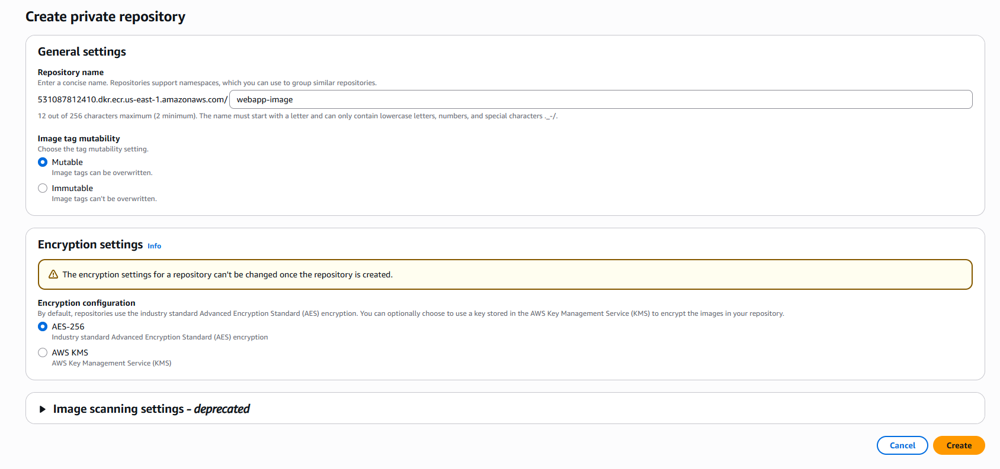

# Course-End Project: Deploying a Web Application to AWS

This project will guide you through the end-to-end process of deploying a containerized web application using modern cloud infrastructure.

### Project Workflow

1.  **Environment Preparation**
2.  **Build & Push Docker Image**
3.  **Deploy with ECS and Fargate**
4.  **Configure & Test**
5.  **Verify & Clean Up**

### Step 1: Prepare the Environment

**1.1 Go to the AWS console and create an EC2 instance of t2.micro**
    

**1.2 Run the command sudo apt update && sudo apt upgrade -y to update and upgrade the system packages**
    

**1.3 Run the command sudo apt install git -y to install the latest version of Git on your EC2 Ubuntu system** 
    

**1.4 Run the command sudo apt install docker.io -y to install Docker and its necessary dependencies**
        

**1.5 Run the command sudo systemctl start docker to start the Docker service on your Ubuntu system, allowing you to run the Docker containers**    
    

### Step 2: Build and push the Docker image

**2.1 Run the command git clone https://github.com/ramkrishnatest/ECS-Fargate.git to download the ECS-Fargate project repository from GitHub to your local machine**
    

**2.2 Run the command cd ECS-Fargate/ to change your current directory to the ECS-Fargate directory**
    

**2.3 Run the command docker build -t deploy to create a Docker image named deploy from the Dockerfile in the current directory**
    
    

**2.4 Before configuring the AWS CLI, click on Security credentials, and then create the Access Key and Secret Key**
    
    

### Step 3: Deploy using ECS and Fargate

**3.1 Navigate to the Create Repository page on Amazon ECR, enter the repository name, and configure visibility settings to either Public or Private to create a new Docker image repository**
    
    

**3.2 Click on Repository and view Push commands; you will see the commands (as shown below) to push your Docker image to the ECR repository**    
    

    Go back to the EC2 console and tag the Docker image to push to the newly created ECR Registry using push commands displayed in the ECR dashboard

**3.3 Run the command sudo aws ecr-public get-login-password --region us-east-1 | sudo docker login --username AWS --password-stdin public.ecr.aws/b5d5d8u4 to authenticate your Docker client with AWS ECR as a superuser, enabling you to push and pull images**
    
    
    
 
 **3.4 Run the command sudo docker build -t webapp-image . to build a Docker image named webapp-image using the Dockerfile in the current directory with superuser permissions, ensuring all necessary Docker operations can execute without permission issues** 
    
     

**3.5 Run the command docker push 531087812410.dkr.ecr.us-east-1.amazonaws.com/webapp-image:latest to upload the Docker image named simplilearn:latest to your AWS Elastic Container Registry using superuser privileges**
    

    Check and ensure that your image is successfully pushed to the ECR

    
    
